# Github excersize walkthrough

* # Login your git and click the new button
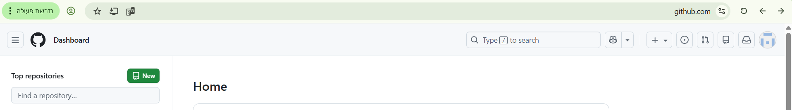

* # give a name and create the repository 
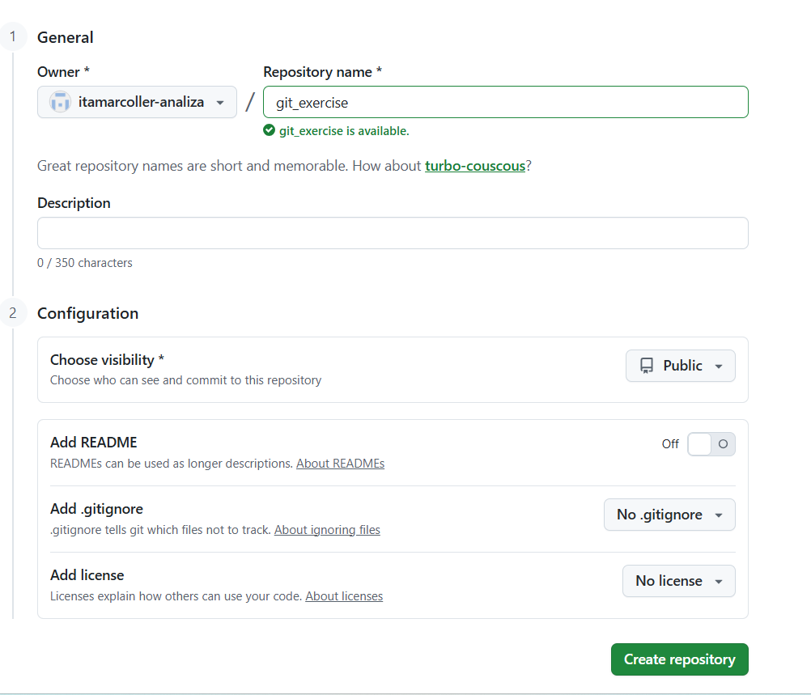

* # copy the url 
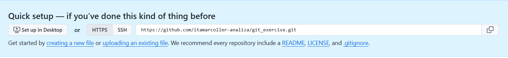

* # do the next commands in your CMD
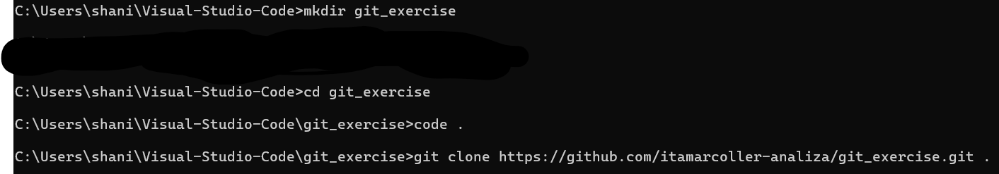

* # Add a READ.md file with a text: "first commit"
* # git add .
* # git commit -m "first commit"
* # git branch -M main
* # git push -u origin main

* # That what you will see in the github: 
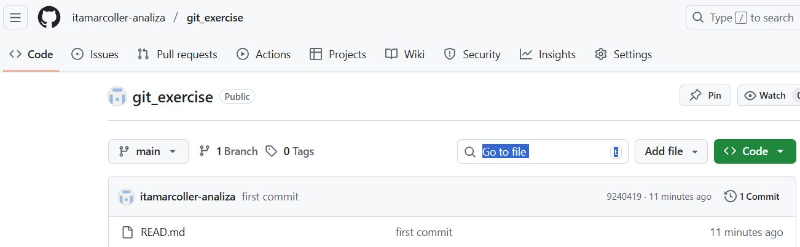

# Now create we create a branch 

* # git branch - will show you on which branch you are, you suppose to be on main branch 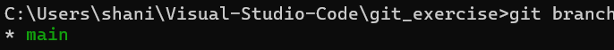

* # do a checkout to a new branch 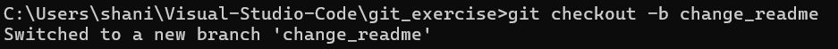
* # Do the following commands in CMD: 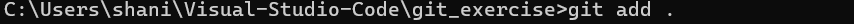 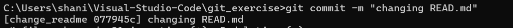 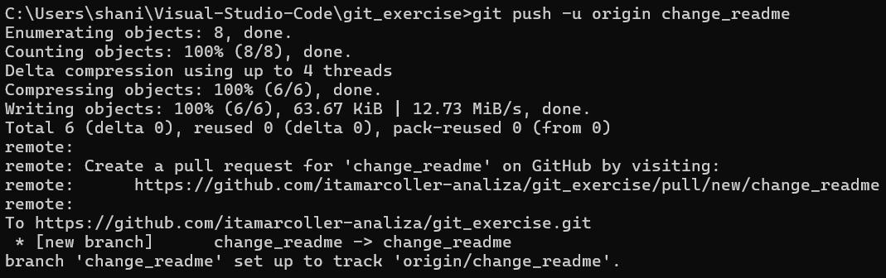

* # Now you will see in your github a pull request, click on the button: 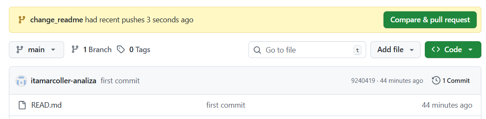

* # You will see your pull request in the github repo, create the pull request: 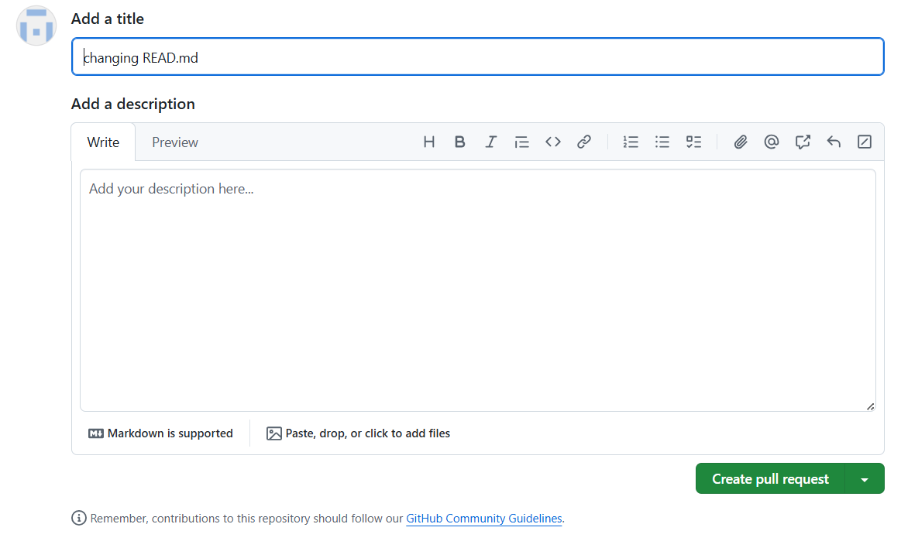

* # Now you will need to merge the pull request and confirm it: 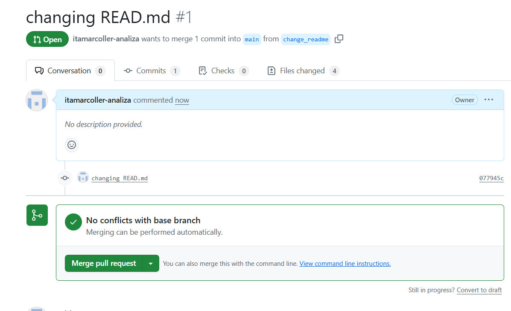 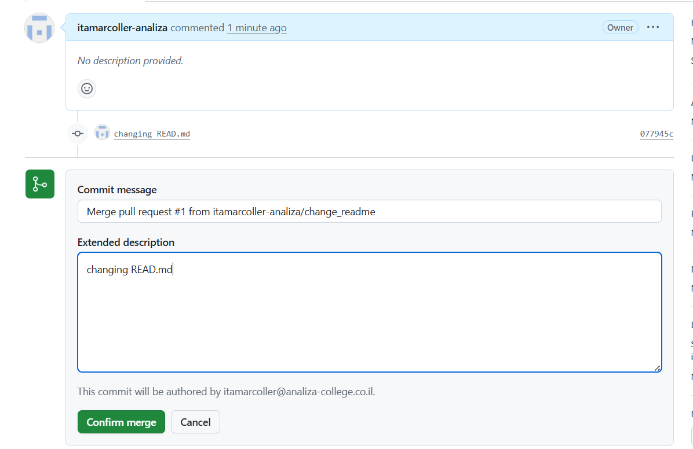

* # Now you will see the remote main branch merged completed: 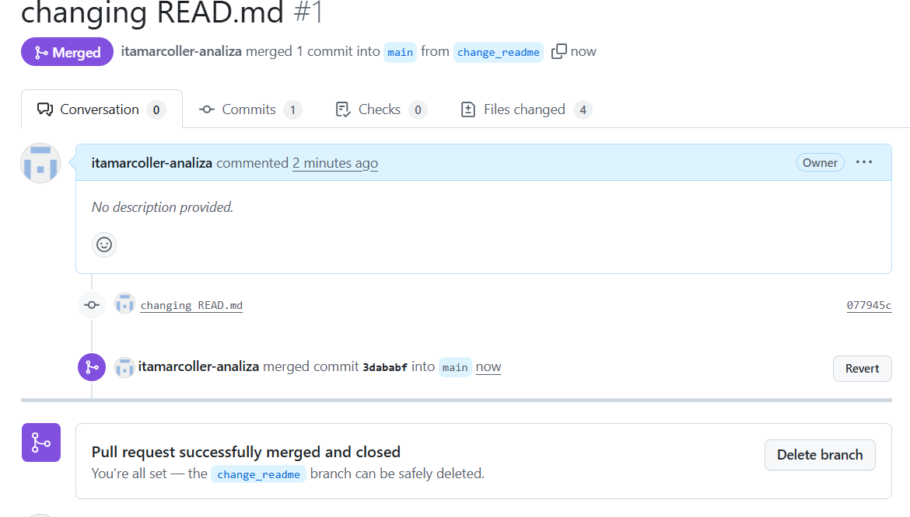

# Now you will need to update your local main branch
